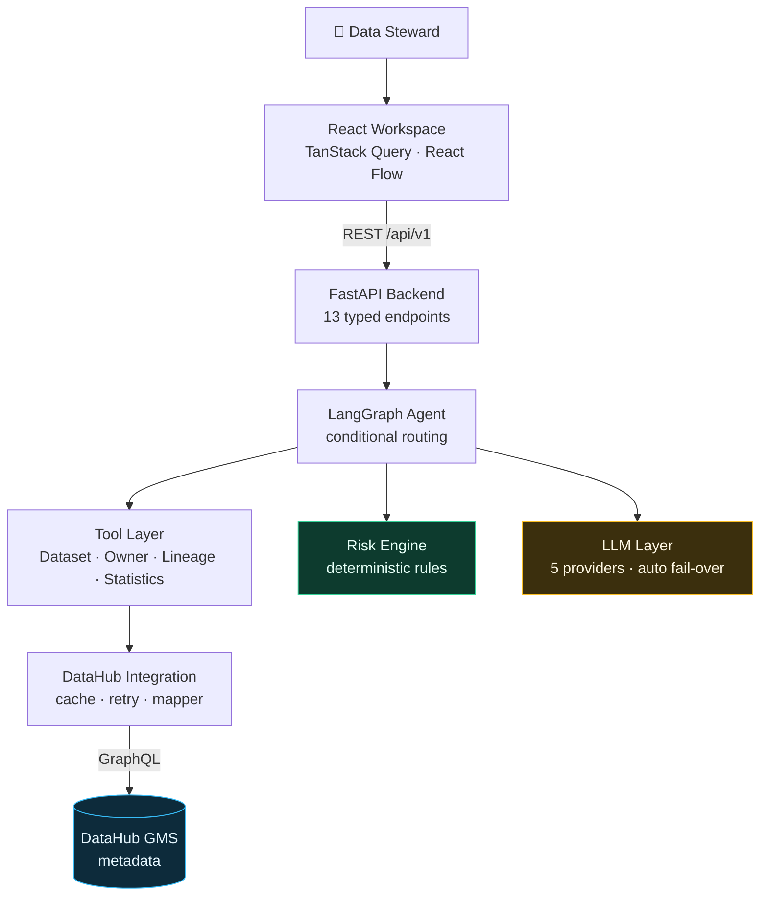
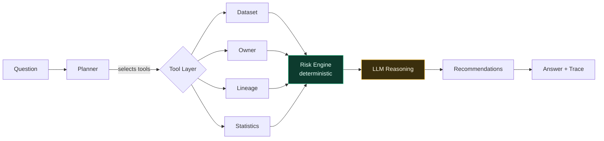

<div align="center">

# DataGuardian AI

**An autonomous AI Metadata Governance Engineer, built on DataHub.**

Finds what is wrong with your data catalogue, proves why it matters, and tells you what to do about it.

[](#testing)
[](#technology-stack)
[](#technology-stack)
[](#datahub-integration)
[](LICENSE)

Built for **Build with DataHub: The Agent Hackathon**

</div>

---

## Table of contents

- [Problem](#problem)
- [Solution](#solution)
- [The core design decision](#the-core-design-decision)
- [Architecture](#architecture)
- [Technology stack](#technology-stack)
- [Quick start](#quick-start)
- [Configuration](#configuration)
- [Demo Mode](#demo-mode)
- [AI workflow](#ai-workflow)
- [DataHub integration](#datahub-integration)
- [Folder structure](#folder-structure)
- [Screenshots](#screenshots)
- [Testing](#testing)
- [Roadmap](#roadmap)
- [Contributing](#contributing)
- [License](#license)

---

## Problem

Data catalogues decay quietly.

Ownership goes stale when people change teams. PII lands in tables nobody tagged. Descriptions never get written. Deprecated datasets keep feeding live dashboards. The metadata that should make a platform governable becomes the thing nobody trusts.

Catalogues are good at **recording** this state. They are not good at **acting** on it — someone still has to notice, judge whether it matters, and fix it. In practice nobody does, because the work is unglamorous and the catalogue has thousands of assets.

The obvious move is to point an LLM at the problem. That fails for a specific reason: **a language model asked to score risk will confidently invent violations that are not in the data.** In governance, a fabricated finding is worse than a missed one — it destroys trust in every other finding.

## Solution

DataGuardian AI closes the loop with a **multi-step agent**, not a chatbot.

It reads metadata from DataHub, applies deterministic governance rules, and only then asks a language model to explain what the rules already concluded.

1. **Monitor** — reads metadata from DataHub over GraphQL.
2. **Detect** — six weighted rules flag missing ownership, untagged PII, absent documentation, oversized blast radius, deprecated-but-in-use assets, and schema drift.
3. **Explain** — the LLM describes the risk and its business impact, grounded strictly in the evidence it was handed.
4. **Recommend** — each finding carries a concrete corrective action.
5. **Prove** — every answer ships with an execution trace showing which tools ran and how long each took.

## The core design decision

> **Deterministic rules decide what is wrong. The LLM only explains it.**

This one boundary is what makes the output trustworthy:

| | Rule engine | Language model |
| --- | --- | --- |
| Decides severity | ✅ | ❌ |
| Finds datasets | ✅ | ❌ |
| Checks owners | ✅ | ❌ |
| Traces lineage | ✅ | ❌ |
| Explains risk | ❌ | ✅ |
| Writes documentation | ❌ | ✅ |
| Recommends actions | ❌ | ✅ |

The consequences are concrete:

- **Reproducible.** The same metadata always produces the same score. A test asserts this by running the agent twice with different stub LLM replies and requiring identical findings.
- **Auditable.** Every point traces to a named rule with a stated weight. A steward can add them up by hand.
- **Cheap.** Scoring 400 assets costs zero tokens.
- **Honest under failure.** If every LLM provider is down, you still get the findings and the score — only the prose is missing, and the response says so.

---

## Architecture



Green is deterministic. Amber is generative. Everything factual flows through the green path.

Full diagrams — agent workflow, request lifecycle, failure handling — are in **[docs/architecture.md](docs/architecture.md)**.

---

## Technology stack

| Layer | Technology |
| --- | --- |
| **Frontend** | React 19 · TypeScript · Vite 8 · Tailwind CSS 4 · TanStack Query · React Flow · Recharts · Framer Motion |
| **Backend** | FastAPI · Python 3.12 · Pydantic v2 · SQLAlchemy 2 · APScheduler · httpx |
| **AI** | LangGraph · Groq · Gemini · xAI (Grok) · OpenAI · Anthropic — switchable by one env var |
| **Data platform** | DataHub v1.5.0.6 · GraphQL API |
| **Quality** | pytest (293 tests) · ruff · mypy · oxlint |
| **Deployment** | Docker · Docker Compose |

---

## Quick start

### Prerequisites

- **Python 3.12+**
- **Node.js 20+**
- **Docker Desktop** — only needed for live DataHub; [Demo Mode](#demo-mode) runs without it

### 1. Clone and configure

```bash
git clone https://github.com/anjaneyulu-01/DataGuardian-AI.git
cd DataGuardian-AI
cp .env.example .env
```

There is **one `.env`** at the repository root. It configures the backend, the frontend, and docker-compose.

The only value you need for AI features is an API key. Groq has a free tier and is the default:

```bash
# .env
GROQ_API_KEY=gsk_...        # https://console.groq.com/keys
```

### 2. Install

```bash
# Windows
powershell -ExecutionPolicy Bypass -File scripts/setup.ps1

# macOS / Linux
bash scripts/setup.sh
```

### 3. Run

```bash
# Terminal 1 — backend
cd backend && uvicorn app.main:app --reload

# Terminal 2 — frontend
cd frontend && npm run dev
```

Open **<http://localhost:5173>**.

Without DataHub running, the app starts in Demo Mode automatically and says so. To connect real metadata, continue below.

### 4. (Optional) Start DataHub

```bash
pip install acryl-datahub
datahub docker quickstart

# Seed a catalogue with realistic governance problems
python datahub/ingest_demo_metadata.py
```

DataHub UI: <http://localhost:9002> · GMS: <http://localhost:8080>

> **Port note.** DataHub GMS uses **8080** and MySQL uses **3306**. If either is taken, remap before starting — see [docs/datahub.md](docs/datahub.md).

---

## Configuration

All settings live in the root `.env`. Every value has a working local default except the API key.

| Variable | Default | Purpose |
| --- | --- | --- |
| `LLM_PROVIDER` | `auto` | `auto` picks the first provider with a key. Or pin: `groq`, `gemini`, `grok`, `openai`, `claude` |
| `LLM_MODEL` | — | Override the model for whichever provider is active |
| `LLM_FALLBACK_ENABLED` | `true` | On a rate limit or timeout, roll over to the next configured provider |
| `GROQ_API_KEY` | — | <https://console.groq.com/keys> (keys start `gsk_`) |
| `GEMINI_API_KEY` | — | <https://aistudio.google.com/apikey> |
| `DATAHUB_GMS_URL` | `http://localhost:8080` | GMS base URL |
| `DATAHUB_TOKEN` | — | Optional for a local quickstart; required for secured instances |
| `DATAHUB_CACHE_TTL_SECONDS` | `60` | Metadata cache TTL |
| `SCHEDULER_ENABLED` | `false` | Background scanning (roadmap) |

> ⚠️ **Groq ≠ Grok.** Two unrelated companies. **Groq** is an inference host (`gsk_` keys, `api.groq.com`); **Grok** is xAI's model (`xai-` keys, `api.x.ai`). Both are supported; the keys are not interchangeable.

---

## Demo Mode

**The app is fully explorable with no backend and no Docker.**

Click **Demo** in the top bar. A persistent banner appears so a viewer can never mistake sample data for their own catalogue.

Demo Mode loads a deterministic 25-asset enterprise catalogue across six domains — **Finance, HR, Sales, Marketing, Customer, Payments** — with realistic governance problems:

| Asset | Domain | Problem |
| --- | --- | --- |
| `fct_payments` | Finance | Tier-1, no owner, no docs, 17 downstream |
| `dim_customer` | Customer | `email`, `date_of_birth`, `home_address` — no PII tag |
| `fct_payroll` | HR | Salary + national ID, unowned, unclassified |
| `fct_orders_v1` | Payments | Deprecated but still read by 5 assets |
| `stg_crm_contacts` | Sales | Not refreshed in 17 days |

Every value is hand-written and fixed — **the same demo, every run**. Nothing is randomised, so a judge re-running a query sees a consistent story.

Demo Mode also engages **automatically** when the backend is unreachable, with each panel tagged `Demo` and a tooltip explaining that live mode needs DataHub.

---

## AI workflow



**Tools are selected, not all invoked** — this is what makes it an agent:

| Question | Tools run | Skipped |
| --- | --- | --- |
| "Find datasets without owners" | dataset, owner | lineage, statistics |
| "What is downstream of X?" | dataset, lineage | owner, statistics |
| "Which datasets are highest risk?" | dataset, owner, lineage | statistics |
| "Create a governance report" | dataset, owner, statistics, report | lineage |

### Risk rules

| Rule | Points | Severity |
| --- | --- | --- |
| Untagged PII | 40 | Critical |
| Missing owner | 30 | High |
| Missing documentation | 20 | Medium |
| Large downstream impact | 20 | High |
| Deprecated but in use | 15 | High |
| Schema drift | 15 | Medium |

Bands: `≥70 critical` · `≥40 high` · `≥20 medium` · else `low`.

Catalogue scoring takes the **worst asset**, not the sum — otherwise a large tidy catalogue would look worse than a small dangerous one.

### API

```bash
curl -X POST http://localhost:8000/api/v1/agent/analyze \
  -H "Content-Type: application/json" \
  -d '{"question": "Find datasets without owners"}'
```

```json
{
  "intent": "find_missing_owners",
  "risk_level": "high",
  "risk_score": 50,
  "summary": "The governance scan found 3 datasets without owners…",
  "findings": [
    { "rule": "missing_owner", "points": 30, "asset_name": "fct_payments", "severity": "high" }
  ],
  "recommendations": [{ "action": "Assign an owner to fct_payments", "priority": "high" }],
  "trace": [{ "node": "planner", "status": "ok", "duration_ms": 2 }],
  "tools_used": ["planner", "datasets", "owners", "risk", "reasoning", "recommendation"],
  "degraded": false
}
```

A **degraded run still returns HTTP 200** with `degraded: true` and the errors listed. A partial governance answer is useful; a stack trace is not.

---

## DataHub integration

Six layers, each depending only on those below:

| File | Responsibility |
| --- | --- |
| `service.py` | Public interface; owns error semantics |
| `cache.py` | TTL + LRU, single-flight, **never caches failures** |
| `mapper.py` | GraphQL dicts → typed models; never raises on sparse data |
| `queries.py` | 12 GraphQL documents, all validated against v1.5.0.6 |
| `graphql.py` | Envelope validation — GraphQL returns 200 on failure |
| `client.py` | Pooled HTTP, auth, jittered backoff |

**Empty is not an error.** An asset with no owner, no description, or no lineage maps cleanly — that sparse state is precisely what the product exists to detect. Only an unresolvable URN is a 404.

Validate the integration against a live instance:

```bash
cd backend && python scripts/validate_datahub.py
```

This never fabricates a result: if DataHub is unreachable, every check reports `BLOCKED` with the reason.

---

## Folder structure

```
DataGuardian-AI/
├── backend/
│   └── app/
│       ├── agents/              LangGraph agent
│       │   ├── nodes/           9 graph nodes
│       │   ├── planner.py       Intent classification + tool selection
│       │   ├── risk_engine.py   Deterministic rules — never the LLM
│       │   ├── workflow.py      Graph topology, conditional routing
│       │   └── state.py         Typed graph state
│       ├── llm/                 Model-agnostic LLM layer
│       │   ├── providers/       5 providers + fail-over chain
│       │   └── prompts/         Centralised prompt templates
│       ├── integrations/datahub/  GraphQL client, cache, mapper
│       ├── tools/               Agent-facing wrappers
│       └── api/v1/              13 REST endpoints
├── frontend/
│   └── src/
│       ├── pages/               8 pages
│       ├── components/ui/       23 reusable components
│       ├── services/            6 services, live + demo fallback
│       ├── hooks/queries.ts     TanStack Query hooks
│       └── data/                Deterministic demo catalogue
├── datahub/                     Ingestion recipes
├── docs/                        Architecture, demo script, guides
└── .env.example                 One file configures everything
```

---

## Screenshots

> Replace these placeholders with captures before submission — see [docs/screenshots.md](docs/screenshots.md) for the shot list and setup steps.

| | |
| --- | --- |
| **Overview** — governance posture at a glance<br/> | **AI Investigator** — the hero feature<br/> |
| **Execution Timeline** — proof the agent planned<br/> | **Governance** — sortable catalogue<br/> |
| **Lineage Explorer** — blast radius<br/> | **Risk Center** — where risk concentrates<br/> |

---

## Testing

```bash
cd backend
pytest -q                    # 293 tests
ruff check . && mypy app     # lint + types

cd ../frontend
npm run lint && npm run build
```

Backend tests use `httpx.MockTransport` at the network boundary only — the real client, GraphQL parsing, mapper, risk engine, and compiled LangGraph all execute. A broken query document or a bad graph edge fails the suite.

Notable coverage: the mapper against sparse and malformed metadata, retry classification (transient vs deterministic), cache properties (never caches failures, single-flight), agent tool-selection routing, and graceful degradation when DataHub or the LLM is down.

---

## Roadmap

**Shipped**

- [x] DataHub GraphQL integration — cache, retry, 12 validated documents
- [x] Model-agnostic LLM layer — 5 providers, automatic fail-over
- [x] LangGraph agent — conditional routing, execution trace
- [x] Deterministic risk engine — 6 weighted rules
- [x] React workspace — 8 pages, live status, Demo Mode
- [x] 293 tests, ruff + mypy clean

**Next**

- [ ] Persist scan history to PostgreSQL (unlocks real trends, replacing three demo panels)
- [ ] Scheduled scans via APScheduler
- [ ] Write remediation back to DataHub with human approval
- [ ] Streaming agent responses (the UI already renders the trace progressively)
- [ ] DataHub MCP server as an alternative transport
- [ ] Slack notifications for critical findings

---

## Contributing

Contributions are welcome.

```bash
git checkout -b feature/your-feature
cd backend && pytest -q && ruff check . && mypy app
cd ../frontend && npm run lint && npm run build
```

**House rules**

1. **Never let the LLM decide facts.** New detection logic belongs in `risk_engine.py`, not a prompt.
2. **Empty is not an error.** Sparse metadata must map cleanly.
3. **Label demo data.** Anything not from a live source is tagged in the UI.
4. **Test the failure path.** Every integration needs a test for what happens when the dependency is down.

Adding an LLM provider is roughly 20 lines — see [backend/app/llm/README.md](backend/app/llm/README.md).

---

## License

[MIT](LICENSE)
