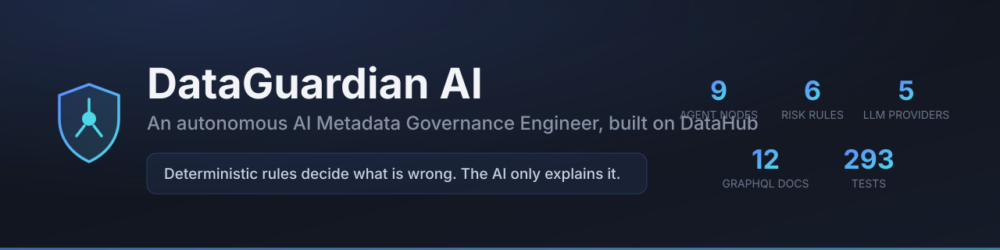
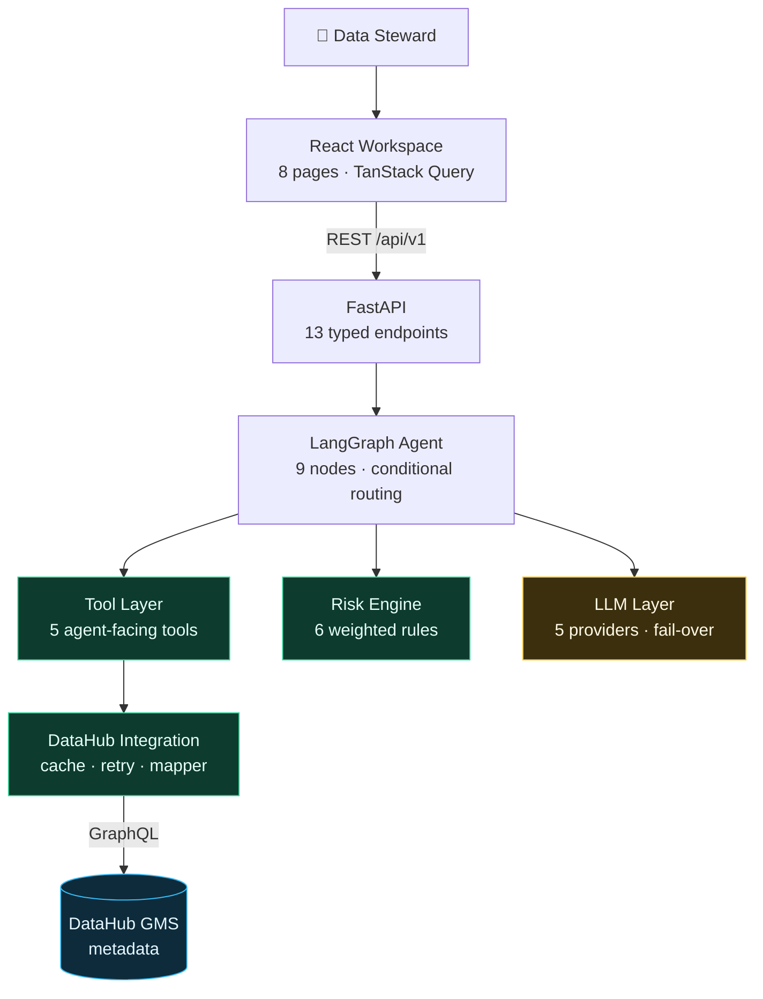
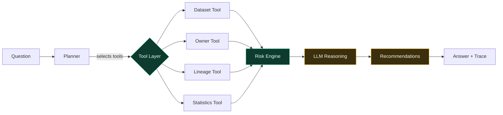
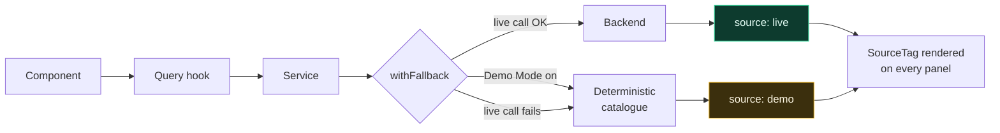
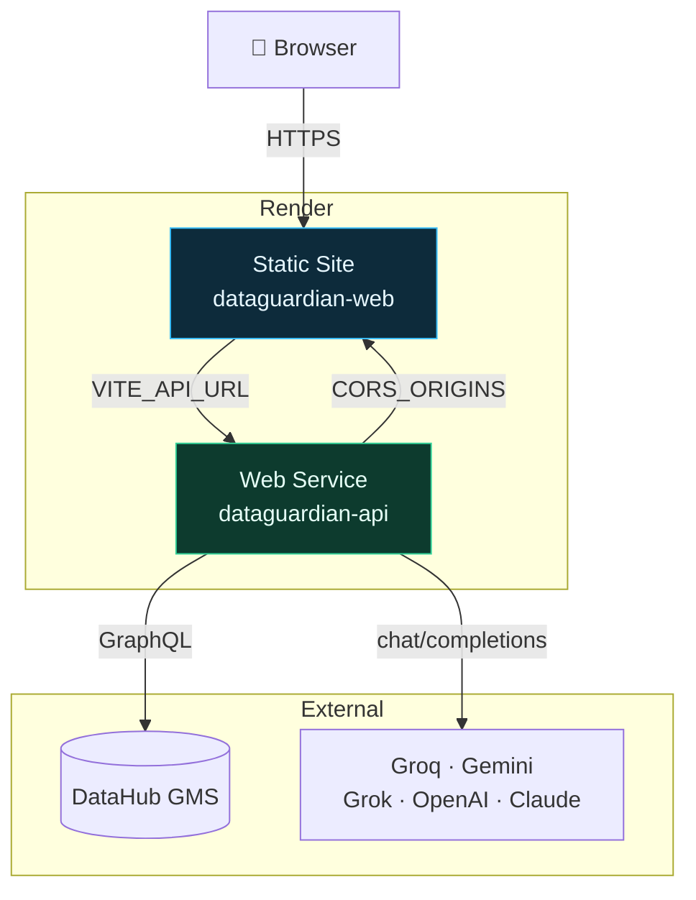

<div align="center">


# DataGuardian AI

### An autonomous AI Metadata Governance Engineer, built on DataHub

**Deterministic rules decide what is wrong. The AI only explains it.**

[](https://www.python.org/)
[](https://fastapi.tiangolo.com/)
[](https://langchain-ai.github.io/langgraph/)
[](https://react.dev/)
[](https://www.typescriptlang.org/)
[](https://datahubproject.io/)

[](#testing)
[](#testing)
[](#testing)
[](LICENSE)

**[Live Demo](#live-demo)** · **[Architecture](#system-architecture)** · **[Quick Start](#installation)** · **[API](#api-reference)** · **[Docs](docs/)**

<sub>Built for **Build with DataHub: The Agent Hackathon**</sub>

</div>

<br />



<br />

> [!TIP]
> **Evaluating this in 60 seconds?** No Docker, no API key, no backend:
>
> ```bash
> git clone https://github.com/anjaneyulu-01/DataGuardian-AI.git
> cd DataGuardian-AI/frontend && npm install && npm run dev
> ```
>
> Click **Demo** in the top bar. The whole workspace runs on a deterministic
> 25-asset catalogue. Then read **[Why this is not a chatbot](#why-this-is-not-a-chatbot)** —
> it is the argument the project is built around.

<details>
<summary><b>Contents</b></summary>

**Understand it** — [The problem](#the-problem) · [The solution](#the-solution) · [Key features](#key-features) · [Architecture](#system-architecture) · [Why DataHub](#why-datahub) · [Why this is not a chatbot](#why-this-is-not-a-chatbot) · [AI workflow](#ai-workflow) · [Screenshots](#screenshots) · [Live demo](#live-demo)

**Run it** — [Installation](#installation) · [Environment variables](#environment-variables) · [Deployment](#deployment) · [API reference](#api-reference) · [Demo Mode](#demo-mode)

**Assess it** — [Security and data handling](#security-and-data-handling) · [Known limitations](#known-limitations--read-before-deploying-beyond-a-demo) · [Cost](#cost) · [Performance](#performance) · [Testing](#testing)

**Extend it** — [Folder structure](#folder-structure) · [Technology stack](#technology-stack) · [Roadmap](#roadmap) · [Contributing](#contributing)

</details>

---

## The problem

A mid-size company runs **thousands of datasets** across Snowflake, Postgres,
Kafka, dbt, and a BI layer. The catalogue records all of it faithfully. Then
entropy sets in:

| What decays | How it happens | What it costs |
| --- | --- | --- |
| **Ownership** | Someone changes team; nobody reassigns their tables | No accountable responder when a pipeline breaks at 2am |
| **PII classification** | A new column lands with an email address in it | Regulatory exposure that surfaces during an audit, not before |
| **Documentation** | The person who understood the table left | Every consumer re-derives the same knowledge from scratch |
| **Deprecated assets** | v2 ships; v1 is marked deprecated but never removed | Dashboards silently serve stale numbers for months |
| **Lineage** | An upstream source is renamed | Impact analysis becomes guesswork |

None of this is hard to *fix*. It is hard to **notice** — and then hard to
**prioritise**, because a catalogue with 4,000 assets and 600 problems gives a
data steward no idea where to start.

So the work does not happen. The catalogue becomes the thing nobody trusts,
and the platform team hears *"is this number right?"* every week.

> [!IMPORTANT]
> **The obvious fix fails.** Point a language model at the catalogue and ask
> it what is wrong, and it will confidently invent violations that are not in
> the data. In governance, a fabricated finding is worse than a missed one —
> it destroys trust in every other finding, including the true ones.

---

## The solution

DataGuardian AI is a **multi-step agent** that closes the loop between
recording metadata and acting on it.

It reads from DataHub, scores risk with **deterministic rules**, and only then
asks a language model to explain what the rules already concluded.

<table>
<tr>
<th width="50%">Traditional governance</th>
<th width="50%">DataGuardian AI</th>
</tr>
<tr>
<td>

Manual quarterly audits

</td>
<td>

On-demand analysis in seconds

</td>
</tr>
<tr>
<td>

A steward reads a 4,000-row catalogue export

</td>
<td>

The agent ranks findings by blast radius

</td>
</tr>
<tr>
<td>

"This table has no owner"

</td>
<td>

"This unowned table feeds the CEO's dashboard through two hops"

</td>
</tr>
<tr>
<td>

Findings depend on who is looking

</td>
<td>

Same metadata → byte-identical score, every run

</td>
</tr>
<tr>
<td>

A spreadsheet of problems

</td>
<td>

A ranked action list with named owners

</td>
</tr>
<tr>
<td>

Nobody can explain the severity ranking

</td>
<td>

Every point traces to a named rule with a stated weight

</td>
</tr>
</table>

---

## Key features

<table>
<tr>
<td width="50%" valign="top">

### 🔍 AI Investigation
Ask in plain language. The agent classifies the intent, **selects only the
tools it needs**, gathers evidence, and returns a structured answer with
summary, risk, evidence, and recommendations.

</td>
<td width="50%" valign="top">

### ⚖️ Deterministic Risk Engine
Six weighted rules — untagged PII, missing owner, missing docs, blast radius,
deprecated-in-use, schema drift. **No LLM involved.** Reproducible and
auditable.

</td>
</tr>
<tr>
<td width="50%" valign="top">

### 🗂 DataHub Integration
Six-layer GraphQL client with TTL caching, jittered retries, and a defensive
mapper. **All 12 query documents validated** against a live DataHub v1.5.0.6.

</td>
<td width="50%" valign="top">

### 🕸 Lineage Explorer
Interactive React Flow graph with four node types — dataset, pipeline,
dashboard, ML model. Click any node for its governance state and an AI
summary.

</td>
</tr>
<tr>
<td width="50%" valign="top">

### 📊 Governance Dashboard
Every catalogued asset scored on coverage, documentation, and health.
Sortable on all columns, severity filters, server-side search, pagination.

</td>
<td width="50%" valign="top">

### 📝 AI Documentation
Five generators — README, dataset docs, business glossary, SQL explanation,
data dictionary. Preview, copy, download as markdown.

</td>
</tr>
<tr>
<td width="50%" valign="top">

### ⏱ Execution Timeline
Every answer ships with the stages that actually ran, their timings, and
**which were skipped**. Colour-coded deterministic vs generative.

</td>
<td width="50%" valign="top">

### 🧪 Demo Mode
A deterministic 25-asset catalogue across six business domains. Runs with
**no backend and no Docker**, behind a permanent banner so it is never
mistaken for real data.

</td>
</tr>
</table>

---

## System architecture

### High-level



<div align="center"><sub><b>Green is deterministic. Amber is generative.</b> Every factual claim flows through the green path.</sub></div>

<br />

> [!NOTE]
> The LLM layer never touches the DataHub integration. No graph node holds a
> DataHub client — the boundary is **structural**, not a convention that could
> be broken by accident.

### Agent workflow



### Frontend data flow



<div align="center"><sub>Every panel is labelled <b>Live</b> or <b>Demo</b>. Unlabelled sample data would undermine the product's whole argument.</sub></div>

### Deployment



<details>
<summary><b>More diagrams</b> — agent state machine, request sequence, failure handling, LLM fail-over</summary>

See **[docs/architecture.md](docs/architecture.md)** for eight diagrams
covering the full system, including the graph state machine, a request
sequence walkthrough, and the failure-handling flow.

</details>

---

## Why DataHub

DataGuardian is not a catalogue. It is a **consumer** of one, and it depends on
DataHub for four things it would otherwise have to invent:

| DataHub provides | DataGuardian uses it for |
| --- | --- |
| **Metadata** — schemas, descriptions, tags, custom properties | Detecting undocumented assets and probable PII columns |
| **Lineage** — upstream and downstream graph | Blast radius, which turns a finding into a *priority* |
| **Ownership** — users, groups, ownership types | The single most common governance failure |
| **Domains & tags** — business classification | Grouping findings the way the organisation is organised |

Without lineage, "this table has no owner" is a fact. With it, the same finding
becomes *"this unowned table feeds the certified revenue rollup and the
executive dashboard"* — which is the difference between a backlog ticket and a
priority.

It reads five entity types — `Dataset`, `Domain`, `CorpUser`, `CorpGroup`, and
whatever `lineage` returns as a related entity — through **12 GraphQL
documents**, all validated against a live DataHub v1.5.0.6 with a harness that
never fabricates a pass:

```bash
cd backend && python scripts/validate_datahub.py --graphql-only
```

> The harness caught a real incompatibility during development:
> `DatasetProperties.created` is a `Long`, not an `AuditStamp`, so requesting
> `created { time }` failed the **entire** query rather than that one field.

> [!IMPORTANT]
> **DataGuardian is strictly read-only.** There is not one GraphQL mutation in
> the codebase — grep for it. It cannot tag, own, deprecate, or delete
> anything in your catalogue. Write-back is on the roadmap and will land
> behind human approval, never as an autonomous action.

It is also polite about it: a 60-second TTL cache with single-flight collapses
concurrent misses into one GMS call, retries are jittered and capped at two,
and page size is bounded so no caller can ask GMS for an unbounded result set.
Point `DATAHUB_GMS_URL` at either the GMS port directly or the frontend proxy
(`http://localhost:9002/api/gms`) — both work.

---

## Why this is not a chatbot

| | Chatbot | DataGuardian AI |
| --- | :---: | :---: |
| **Tool use** | Fixed set, or none | **Selects tools per question** |
| **Planning** | Single turn | **Multi-step graph with conditional routing** |
| **Facts** | Recalled from training | **Fetched live from DataHub** |
| **Risk scoring** | Model asserts a number | **Deterministic rules compute it** |
| **Reproducibility** | Different answer each run | **Byte-identical findings** |
| **Failure** | Errors out or hallucinates | **Degrades, reports what is missing** |
| **Auditability** | Opaque | **Full execution trace with timings** |

Concretely — ask *"find datasets without owners"* and the agent **decides not
to call the lineage tool**. Ask about downstream impact and it decides to. The
execution timeline shows both decisions, including the stages it skipped.

And the risk score never depends on the model. There is a test that proves it:

```python
# backend/tests/test_agent_graph.py
async def test_risk_score_is_absent_from_llm_control(self) -> None:
    # Two runs with different stub replies must produce the same score,
    # because the score never depends on model output.
    first = await build_agent(
        datasets=[make_dataset(owned=False)], llm=StubLLM(reply="A")
    ).analyze("Find datasets without owners")
    second = await build_agent(
        datasets=[make_dataset(owned=False)], llm=StubLLM(reply="B")
    ).analyze("Find datasets without owners")

    assert first.risk_score == second.risk_score
    assert {f.rule for f in first.findings} == {f.rule for f in second.findings}
```

---

## AI workflow

**1 · Planner** — classifies the question into one of seven intents and selects
the tools it needs. Keyword rules first (instant, free, reproducible); the LLM
is consulted only when scoring is a genuine tie, and if it is unreachable the
rule verdict stands.

**2 · Tools** — only the selected ones run:

| Question | Tools run | Skipped |
| --- | --- | --- |
| "Find datasets without owners" | dataset, owner | lineage, statistics |
| "What is downstream of X?" | dataset, lineage | owner, statistics |
| "Which datasets are highest risk?" | dataset, owner, lineage | statistics |
| "Create a governance report" | dataset, owner, statistics, report | lineage |

**3 · Risk engine** — deterministic scoring, no LLM:

| Rule | Points | Severity |
| --- | :---: | --- |
| Untagged PII | 40 | 🔴 Critical |
| Missing owner | 30 | 🟠 High |
| Missing documentation | 20 | 🔵 Medium |
| Large downstream impact | 20 | 🟠 High |
| Deprecated but in use | 15 | 🟠 High |
| Schema drift | 15 | 🔵 Medium |

Bands: `≥70` critical · `≥40` high · `≥20` medium · else low.

Catalogue scoring takes the **worst asset**, not the sum — otherwise a large
tidy catalogue would score worse than a small dangerous one, inverting the
priority a steward needs.

**4 · LLM** — receives the verdict *and* the evidence that produced it. It is
told the score, never asked to compute it.

**5 · Recommendations** — corrective actions bounded by the findings. The model
cannot recommend fixing something the rule engine never found.

### Why the split

| | Rule engine | Language model |
| --- | :---: | :---: |
| Decides severity | ✅ | ❌ |
| Finds datasets | ✅ | ❌ |
| Checks owners | ✅ | ❌ |
| Traces lineage | ✅ | ❌ |
| Explains risk | ❌ | ✅ |
| Writes documentation | ❌ | ✅ |
| Recommends actions | ❌ | ✅ |

- **Reproducible** — same metadata, same score, always.
- **Auditable** — every point traces to a named rule; add them up by hand.
- **Cheap** — scoring 400 assets costs zero tokens.
- **Honest under failure** — if every LLM provider is down you still get the
  findings and the score. Only the prose is missing, and the response says so.

---

## Screenshots

> [!NOTE]
> **Captures pending.** The images below are placeholders until the run is
> recorded — see **[docs/screenshots.md](docs/screenshots.md)** for the shot
> list and framing. Each caption states what its panel shows, so this section
> reads correctly either way.

<table>
<tr>
<td width="50%">

**Overview** — governance posture at a glance


</td>
<td width="50%">

**AI Investigator** — the hero feature


</td>
</tr>
<tr>
<td width="50%">

**Execution Timeline** — proof the agent planned


</td>
<td width="50%">

**Governance** — the sortable catalogue


</td>
</tr>
<tr>
<td width="50%">

**Lineage Explorer** — blast radius


</td>
<td width="50%">

**Risk Center** — where risk concentrates


</td>
</tr>
<tr>
<td width="50%">

**Documentation** — AI-drafted, human-reviewed


</td>
<td width="50%">

**Architecture** — the design, in-app


</td>
</tr>
</table>

---

## Live demo

> [!IMPORTANT]
> Fill these in after deploying — see **[docs/deployment.md](docs/deployment.md)**.
> The backend runs on Render's free tier, so the **first request after idle
> takes ~50 seconds** to cold-start. Open the API health link first to warm it.

<div align="center">

[](#)
[](#)
[](#)
[](https://github.com/anjaneyulu-01/DataGuardian-AI)

</div>

**No infrastructure needed to explore it.** Clone, `npm run dev`, click
**Demo** in the top bar — the entire UI works with no backend and no Docker.

---

## Installation

### Prerequisites

| | Version | Required? |
| --- | --- | --- |
| Python | 3.12+ | Backend |
| Node.js | 20+ (built on 22) | Frontend |
| Docker Desktop | any | Only for live DataHub |

### 1 · Clone and configure

```bash
git clone https://github.com/anjaneyulu-01/DataGuardian-AI.git
cd DataGuardian-AI
cp .env.example .env
```

There is **one `.env`** at the repository root. It configures the backend, the
frontend (via Vite's `envDir`), and docker-compose.

The only value you need is one LLM key. Groq has a free tier:

```bash
GROQ_API_KEY=gsk_...      # https://console.groq.com/keys
```

> [!WARNING]
> **Groq ≠ Grok.** Two unrelated companies with nearly identical names.
> **Groq** is an inference host (`gsk_` keys, `api.groq.com`); **Grok** is
> xAI's model (`xai-` keys, `api.x.ai`). Both are supported; the keys are not
> interchangeable.

### 2 · Install

```bash
# Windows
powershell -ExecutionPolicy Bypass -File scripts/setup.ps1

# macOS / Linux
bash scripts/setup.sh
```

<details>
<summary>Manual installation</summary>

```bash
cd backend
python -m venv .venv
source .venv/bin/activate        # Windows: .\.venv\Scripts\Activate.ps1
pip install -r requirements.txt -r requirements-dev.txt

cd ../frontend
npm install
```

</details>

### 3 · Run

```bash
# Terminal 1
cd backend && uvicorn app.main:app --reload

# Terminal 2
cd frontend && npm run dev
```

| | URL |
| --- | --- |
| Workspace | <http://localhost:5173> |
| Swagger | <http://localhost:8000/docs> |

### 4 · Optional — live DataHub

```bash
pip install acryl-datahub
datahub docker quickstart

# Seed a catalogue with realistic governance problems
python datahub/ingest_demo_metadata.py
```

DataHub UI at <http://localhost:9002>.

> [!TIP]
> DataHub GMS wants port **8080** and MySQL wants **3306**. If either is taken,
> remap before starting — the CLI accepts `--mysql-port`. See
> [docs/datahub.md](docs/datahub.md).

---

## Environment variables

All in the root `.env`. Every value has a working local default except the API key.

<details open>
<summary><b>LLM</b></summary>

| Variable | Default | Description |
| --- | --- | --- |
| `LLM_PROVIDER` | `auto` | `auto` picks the first provider with a key. Or pin: `groq`, `gemini`, `grok`, `openai`, `claude` |
| `LLM_MODEL` | — | Overrides the model for whichever provider is active |
| `LLM_FALLBACK_ENABLED` | `true` | On a rate limit or timeout, roll over to the next configured provider |
| `LLM_TIMEOUT` | `60` | Seconds. Generous — reasoning models are slow |
| `LLM_MAX_TOKENS` | `4096` | Reasoning models spend part of this on internal thinking |
| `LLM_TEMPERATURE` | `0.2` | Low by design: grounded explanation, not creativity |
| `GROQ_API_KEY` | — | <https://console.groq.com/keys> |
| `GEMINI_API_KEY` | — | <https://aistudio.google.com/apikey> |
| `XAI_API_KEY` | — | <https://console.x.ai> |

</details>

<details>
<summary><b>DataHub</b></summary>

| Variable | Default | Description |
| --- | --- | --- |
| `DATAHUB_GMS_URL` | `http://localhost:8080` | GMS base URL |
| `DATAHUB_TOKEN` | — | Optional locally; required for secured instances |
| `DATAHUB_TIMEOUT_SECONDS` | `30` | |
| `DATAHUB_MAX_RETRIES` | `2` | Transient failures only — never auth or query errors |
| `DATAHUB_CACHE_ENABLED` | `true` | |
| `DATAHUB_CACHE_TTL_SECONDS` | `60` | Metadata changes on an ingestion cadence, not per request |

</details>

<details>
<summary><b>Application</b></summary>

| Variable | Default | Description |
| --- | --- | --- |
| `APP_ENV` | `local` | `local` · `development` · `staging` · `production` |
| `DEBUG` | *derived* | Leave unset — follows `APP_ENV` so production cannot ship debug logging by omission |
| `PORT` | `8000` | Injected by Render in production |
| `CORS_ORIGINS` | localhost:5173 | Accepts JSON array **or** comma-separated. Never `*` |
| `SCHEDULER_ENABLED` | `false` | Background scanning (roadmap) |
| `DATABASE_URL` | — | **Not used yet.** No ORM model exists; the engine is never touched |

</details>

<details>
<summary><b>Frontend</b> — only <code>VITE_</code> vars reach the browser</summary>

| Variable | Default | Description |
| --- | --- | --- |
| `VITE_API_URL` | — | Backend origin. **Required in production.** Inlined at build time |
| `VITE_BACKEND_URL` | `http://localhost:8000` | Dev-server proxy target |

> Never prefix a secret with `VITE_` — it would be readable in the public bundle.

</details>

---

## Deployment

Both services deploy to **Render** from [`render.yaml`](render.yaml).

| Service | Type | Root | Build | Start |
| --- | --- | --- | --- | --- |
| `dataguardian-api` | Web Service | `backend` | `pip install -r requirements.txt` | `uvicorn app.main:app --host 0.0.0.0 --port $PORT` |
| `dataguardian-web` | Static Site | `frontend` | `npm ci && npm run build` | publish `dist` |

Health check: `/api/v1/health` — liveness only, so a DataHub or LLM outage can
never cause Render to restart a healthy API.

```bash
# Verify a deployment end to end
python scripts/smoke_test.py \
  --api https://dataguardian-api.onrender.com \
  --web https://dataguardian-web.onrender.com
```

> [!CAUTION]
> **Two things break most first deploys.** `VITE_API_URL` is inlined at *build*
> time, so changing it needs a rebuild, not a restart. And `CORS_ORIGINS` must
> be set to the frontend origin after its first deploy — the backend logs a
> loud startup error if you forget.

Full walkthrough, troubleshooting table, and rollback:
**[docs/deployment.md](docs/deployment.md)**

---

## API reference

13 endpoints. Interactive docs at `/docs`.

<details open>
<summary><b>Agent</b></summary>

```http
POST /api/v1/agent/analyze
Content-Type: application/json

{ "question": "Find datasets without owners" }
```

Abridged response — every field below is on the real contract
(`AgentResult`), which also carries `evidence`, `business_impact`, and
`next_steps`:

```json
{
  "question": "Find datasets without owners",
  "intent": "find_missing_owners",
  "risk_level": "high",
  "risk_score": 50,
  "summary": "The governance scan found 3 datasets without owners…",
  "findings": [
    {
      "rule": "missing_owner",
      "title": "No owner assigned",
      "severity": "high",
      "points": 30,
      "asset_urn": "urn:li:dataset:(urn:li:dataPlatform:postgres,fct_payments,PROD)",
      "asset_name": "fct_payments",
      "detail": "No owner is assigned, so there is no accountable responder…"
    }
  ],
  "recommendations": [
    {
      "action": "Assign an owner to fct_payments",
      "rationale": "17 downstream assets depend on it, including two certified dashboards.",
      "priority": "high"
    }
  ],
  "trace": [
    { "node": "planner",   "status": "ok", "duration_ms": 2 },
    { "node": "datasets",  "status": "ok", "duration_ms": 136 },
    { "node": "owners",    "status": "ok", "duration_ms": 51 },
    { "node": "risk",      "status": "ok", "duration_ms": 1 },
    { "node": "reasoning", "status": "ok", "duration_ms": 926 }
  ],
  "tools_used": ["planner", "datasets", "owners", "risk", "reasoning"],
  "llm_provider": "groq",
  "duration_ms": 1116,
  "errors": [],
  "degraded": false
}
```

`findings[].rule` and `findings[].points` exist so a reader can **add the
score up by hand** and check the engine's arithmetic. That is the whole reason
risk is not an LLM job.

A **degraded run still returns HTTP 200** with `degraded: true` and the errors
listed. A partial governance answer is useful; a stack trace is not.

</details>

<details>
<summary><b>Health</b></summary>

| Method | Endpoint | Returns |
| --- | --- | --- |
| `GET` | `/api/v1/health` | Liveness. Touches nothing external |
| `GET` | `/api/v1/health/datahub` | Connectivity, version, cache stats. **Always 200** — read `reachable` |
| `GET` | `/api/v1/health/llm` | Provider, model, fail-over chain |

</details>

<details>
<summary><b>Metadata</b></summary>

| Method | Endpoint | Description |
| --- | --- | --- |
| `GET` | `/api/v1/datasets` | Paginated catalogue. `?query=&start=&count=` |
| `GET` | `/api/v1/datasets/{urn}` | One dataset with schema and glossary terms |
| `GET` | `/api/v1/owners` | Catalogue-wide owners, or `?dataset_urn=` for one asset |
| `GET` | `/api/v1/domains` | Business domains with asset counts |
| `GET` | `/api/v1/domains/{urn}` | One domain |
| `GET` | `/api/v1/lineage` | `?urn=&direction=UPSTREAM\|DOWNSTREAM` |
| `GET` | `/api/v1/lineage/impact` | Both directions in one call |
| `GET` | `/api/v1/statistics` | Profiling and usage for one dataset |

</details>

<details>
<summary><b>Error semantics</b></summary>

| Status | Meaning | Retryable |
| --- | --- | :---: |
| `404` | URN does not exist | ❌ |
| `422` | Invalid request | ❌ |
| `502` | DataHub rejected the query, or bad credentials | ❌ |
| `503` | DataHub unreachable | ✅ |
| `504` | DataHub timed out | ✅ |

Authentication failure returns **502, not 401** — a 401 would wrongly imply the
caller of *our* API is unauthenticated, when the real problem is our
server-side `DATAHUB_TOKEN`.

</details>

---

## Security and data handling

### What leaves your network

The only outbound calls are to DataHub and to your chosen LLM provider. The
reasoning node sends exactly this payload — it is one function, [`_payload`
in `reasoning_node.py`](backend/app/agents/nodes/reasoning_node.py), and it is
worth reading before you deploy:

| Sent to the LLM | Never sent |
| --- | --- |
| The question you typed | **Row data — the system never has it** |
| Intent, risk score, risk level | Credentials or tokens |
| Up to 15 findings (rule, severity, asset name, detail) | Full catalogue dumps |
| Evidence and profiling statistics gathered by the tools | Anything from a dataset's contents |

> [!WARNING]
> **Metadata is sent to a third-party model.** Table names, column names,
> descriptions, and owner names appear in the prompt. DataGuardian reads only
> DataHub metadata and never queries the underlying datasets, so no customer
> records can leave — but if your *schema names themselves* are sensitive, run
> a self-hosted OpenAI-compatible endpoint. Point `OPENAI_BASE_URL` at it and
> nothing else changes.

### Posture

| Property | Status |
| --- | --- |
| DataHub access | **Read-only.** Zero mutations in the codebase |
| Persistence | **None.** No database is used; the cache is in-memory with a 60s TTL and dies with the process |
| Secrets | Environment only. `.env` is gitignored; nothing is `VITE_`-prefixed, so no key can reach the browser bundle |
| CORS | Explicit origin list, never `*`. Production boot logs a loud error if only localhost is allowed |
| Retries | Transient failures only — a bad credential is never replayed |
| Debug output | Derived from `APP_ENV`, so a production deploy cannot ship debug logging by forgetting a variable |
| Dependencies | `npm audit`: **0 vulnerabilities** across 202 packages. `react-router` was moved off v7, which carried advisory GHSA-qwww-vcr4-c8h2 |

### Known limitations — read before deploying beyond a demo

> [!CAUTION]
> **The API has no authentication.** Every endpoint is open to anyone who can
> reach it. This is acceptable for a hackathon demo over read-only metadata; it
> is not acceptable on a corporate network. Put it behind your gateway, SSO
> proxy, or VPN before pointing it at a real catalogue.

- **No rate limiting.** A caller can drive LLM spend without bound.
- **No multi-tenancy.** One DataHub instance, one set of credentials, per deploy.
- **No audit log.** Runs are traced in the response but nothing is persisted,
  so there is no record of who asked what.
- **Single worker.** `render.yaml` runs one uvicorn worker; the in-memory cache
  is per-process and would need to be shared before scaling out.
- **Catalogue scale is untested past a few hundred assets.** The paginated
  reads are correct, but incremental scanning for six-figure catalogues is on
  the roadmap, not built.

---

## Demo Mode

**The entire UI works with no backend and no Docker.** Click **Demo** in the
top bar.

### Why it exists

Two separate reasons, and the distinction matters:

1. **Deliberate** — you want the sample catalogue even on a healthy backend.
   A fresh DataHub quickstart is empty; an empty dashboard demonstrates
   nothing.
2. **Automatic fallback** — the backend is unreachable, so each service falls
   back on its own. Handled per-call, not globally, because it is a property
   of one failed request rather than a mode.

Both paths tag their data `demo`, so **every panel is labelled either way.**

### What it loads

A deterministic 25-asset catalogue across **Finance, HR, Sales, Marketing,
Customer, Payments**:

| Asset | Domain | Problem |
| --- | --- | --- |
| `fct_payments` | Finance | Tier-1, no owner, no docs, 17 downstream |
| `dim_customer` | Customer | `email`, `date_of_birth`, `home_address` — no PII tag |
| `fct_payroll` | HR | Salary + national ID, unowned, unclassified |
| `fct_orders_v1` | Payments | Deprecated but still read by 5 assets |
| `stg_crm_contacts` | Sales | Not refreshed in 17 days |

Every value is hand-written and fixed. **Nothing is randomised**, so the same
demo runs identically every time — a judge re-running a query sees a consistent
story, not a different one.

Health and coverage are *derived* from the same weighting the live service
applies to real DataHub data, so Demo Mode and Live Mode grade on the same
curve.

### Limitations — stated plainly

- Demo data is **not** from your DataHub. The banner says so permanently.
- Agent answers in Demo Mode are keyword-matched canned responses, **not** real
  agent runs. With a backend, they are genuine.
- Three panels are demo-only **even in live mode** — the risk trend, activity
  feed, and standing violations list all need persisted scan history, which is
  on the roadmap. They carry a `Demo` tag with a tooltip explaining why.

> [!NOTE]
> Showing invented governance figures unlabelled would undermine the exact
> claim this product makes. Labelling them costs a little polish and buys the
> whole argument.

---

## Cost

The architecture keeps token spend structurally low, because **the expensive
part is not the AI part**.

| Work | LLM calls | Cost |
| --- | :---: | --- |
| Fetching metadata, owners, lineage | 0 | Free — GraphQL |
| **Scoring risk across the whole catalogue** | **0** | **Free — deterministic rules** |
| Explaining the verdict | 1 | Bounded by `LLM_MAX_TOKENS` (4096) |
| Drafting recommendations | 1 | Bounded the same way |
| Generating a report, when asked | 1 | Bounded the same way |
| Classifying intent | 0, or 1 on a genuine tie | Keyword rules resolve almost everything |

So an analysis costs **at most three bounded completions**, no matter how large
the catalogue. Scoring 400 assets costs the same as scoring 4.

Running the whole thing on free tiers — Groq for inference, Render for both
services — costs **$0**, with the free-tier cold start as the only tax. There
is no database to pay for, because [none is used](#known-limitations--read-before-deploying-beyond-a-demo).

---

## Performance

| Technique | Detail |
| --- | --- |
| **Code splitting** | Lineage, Risk Center, and Architecture lazy-load, keeping React Flow and Recharts out of the initial bundle |
| **Bundle** | ~189 kB gzip on first paint (app + vendor + CSS); React Flow and Recharts arrive only on route entry |
| **Query caching** | TanStack Query with per-data-type stale times; `placeholderData` stops tables flashing empty while typing |
| **Backend cache** | TTL + LRU with **single-flight** — concurrent misses collapse into one GMS call |
| **Never caches failures** | A DataHub blip cannot be pinned in place for the whole TTL |
| **Asset caching** | Content-hashed assets `immutable`; `index.html` `no-cache` so deploys are picked up |
| **Memoisation** | Sort/filter pipelines memoised behind stable references |

---

## Testing

```bash
cd backend
pytest -q                    # 293 tests
ruff check . && mypy app     # lint + types

cd ../frontend
npm run lint && npm run build

python scripts/smoke_test.py            # deployment verification
python scripts/validate_datahub.py      # GraphQL against a live instance
```

| Suite | What it proves |
| --- | --- |
| **293 backend tests** | Only the network boundary is mocked — real client, GraphQL parsing, mapper, risk engine, and compiled LangGraph all execute |
| **Mapper** | Sparse and malformed metadata maps cleanly; blank descriptions and `lastModified: 0` handled |
| **Retry** | Transient failures retry; deterministic ones never do |
| **Cache** | Never caches failures; single-flight collapses concurrent misses |
| **Agent routing** | Tool selection per intent, including which tools are *skipped* |
| **Degradation** | Answers still return when DataHub or every LLM provider is down |
| **Smoke test** | 7 check groups against a live deployment; exit code gates a release |

Tests are hermetic: an autouse fixture isolates `Settings` from the developer's
`.env` and shell, so a personal API key cannot change a test outcome.

---

## Folder structure

```
DataGuardian-AI/
│
├── backend/
│   ├── app/
│   │   ├── agents/                  LangGraph agent
│   │   │   ├── nodes/               9 graph nodes, one file each
│   │   │   ├── planner.py           Intent classification + tool selection
│   │   │   ├── risk_engine.py       6 deterministic rules — never the LLM
│   │   │   ├── workflow.py          Graph topology, conditional routing
│   │   │   ├── executor.py          Timing, logging, failure containment
│   │   │   └── state.py             Typed graph state
│   │   │
│   │   ├── llm/                     Model-agnostic LLM layer
│   │   │   ├── providers/           5 providers + fail-over chain
│   │   │   ├── prompts/             Centralised, reviewable templates
│   │   │   └── factory.py           LLM_PROVIDER → instance
│   │   │
│   │   ├── integrations/datahub/    Six-layer GraphQL client
│   │   │   ├── service.py           Public interface, error semantics
│   │   │   ├── cache.py             TTL + LRU + single-flight
│   │   │   ├── mapper.py            Dicts → typed models
│   │   │   └── queries.py           12 validated GraphQL documents
│   │   │
│   │   ├── tools/                   5 agent-facing wrappers
│   │   ├── api/v1/                  13 REST endpoints
│   │   ├── core/                    Database, logging, exceptions
│   │   └── config/                  Typed settings, single source
│   │
│   ├── scripts/validate_datahub.py  GraphQL acceptance harness
│   └── tests/                       293 tests
│
├── frontend/
│   └── src/
│       ├── pages/                   8 pages + 404
│       ├── components/ui/           23 reusable components
│       ├── services/                7 services, live + demo fallback
│       ├── hooks/queries.ts         TanStack Query hooks, centralised keys
│       ├── data/                    Deterministic demo catalogue
│       └── app/                     Providers, error boundary, demo mode
│
├── datahub/ingest_demo_metadata.py  Seeds a catalogue with real problems
├── docs/                            Architecture, deployment, demo script
├── scripts/smoke_test.py            Post-deployment verification
├── render.yaml                      Render blueprint — both services
└── .env.example                     One file configures everything
```

---

## Technology stack

| Layer | Technologies |
| --- | --- |
| **Frontend** | React 19 · TypeScript 6 · Vite 8 · Tailwind CSS 4 · TanStack Query · React Flow · Recharts · Framer Motion · Lucide |
| **Backend** | FastAPI · Python 3.12 · Pydantic v2 · pydantic-settings · SQLAlchemy 2 · APScheduler · httpx |
| **AI** | LangGraph · Groq · Google Gemini · xAI Grok · OpenAI · Anthropic — switchable by one env var |
| **Data platform** | DataHub v1.5.0.6 · GraphQL · acryl-datahub CLI |
| **Testing** | pytest · pytest-asyncio · httpx MockTransport · ruff · mypy · oxlint |
| **Infrastructure** | Docker · Docker Compose · Render |

---

## Roadmap

**Shipped**

- [x] DataHub GraphQL integration — cache, retry, 12 documents validated against v1.5.0.6
- [x] Model-agnostic LLM layer — 5 providers, automatic fail-over
- [x] LangGraph agent — 9 nodes, conditional routing, execution trace
- [x] Deterministic risk engine — 6 weighted rules, reproducible scores
- [x] React workspace — 8 pages, live status, Demo Mode
- [x] Render deployment — blueprint, smoke tests, deployment guide
- [x] 293 tests · ruff · mypy · oxlint clean

**In progress**

- [ ] Screenshots and demo video for submission

**Next**

- [ ] **Persist scan history to PostgreSQL** — unlocks real trends, replacing the three demo-tagged panels
- [ ] Scheduled scans via APScheduler
- [ ] Write remediation back to DataHub with human-in-the-loop approval
- [ ] Streaming agent responses — the UI already renders the trace progressively
- [ ] DataHub MCP server as an alternative transport
- [ ] Slack notifications for critical findings
- [ ] Incremental scanning for catalogues in the 100k-asset range

---

## Contributing

Contributions welcome.

```bash
git checkout -b feature/your-feature

cd backend  && pytest -q && ruff check . && mypy app
cd frontend && npm run lint && npm run build
```

### House rules

> [!IMPORTANT]
> **1. Never let the LLM decide facts.** New detection logic belongs in
> `risk_engine.py`, not in a prompt. This is the project's central invariant.

**2. Empty is not an error.** Sparse metadata must map cleanly — an asset with
no owner is what the product exists to find, not an exception.

**3. Label demo data.** Anything not from a live source is tagged in the UI.

**4. Test the failure path.** Every integration needs a test for what happens
when the dependency is down.

Adding an LLM provider is roughly 20 lines — see
[backend/app/llm/README.md](backend/app/llm/README.md).

### Where things live

| Doc | Contents |
| --- | --- |
| [docs/architecture.md](docs/architecture.md) | 8 Mermaid diagrams |
| [docs/deployment.md](docs/deployment.md) | Render walkthrough, troubleshooting, rollback |
| [docs/demo-script.md](docs/demo-script.md) | Timed 4-minute walkthrough |
| [docs/datahub.md](docs/datahub.md) | DataHub setup and debugging |
| [backend/app/agents/README.md](backend/app/agents/README.md) | Agent internals |
| [backend/app/llm/README.md](backend/app/llm/README.md) | Adding a provider |

---

## License

[MIT](LICENSE) © 2026

---

<div align="center">

### DataGuardian AI

**Deterministic rules decide what is wrong. The AI only explains it.**

Built for **[Build with DataHub: The Agent Hackathon](https://datahubproject.io/)**

<sub>Powered by [DataHub](https://datahubproject.io/) · [LangGraph](https://langchain-ai.github.io/langgraph/) · [FastAPI](https://fastapi.tiangolo.com/) · [React](https://react.dev/)</sub>

<br />

⭐ **Star this repo** if a governance agent that cannot hallucinate its findings sounds useful.

</div>
