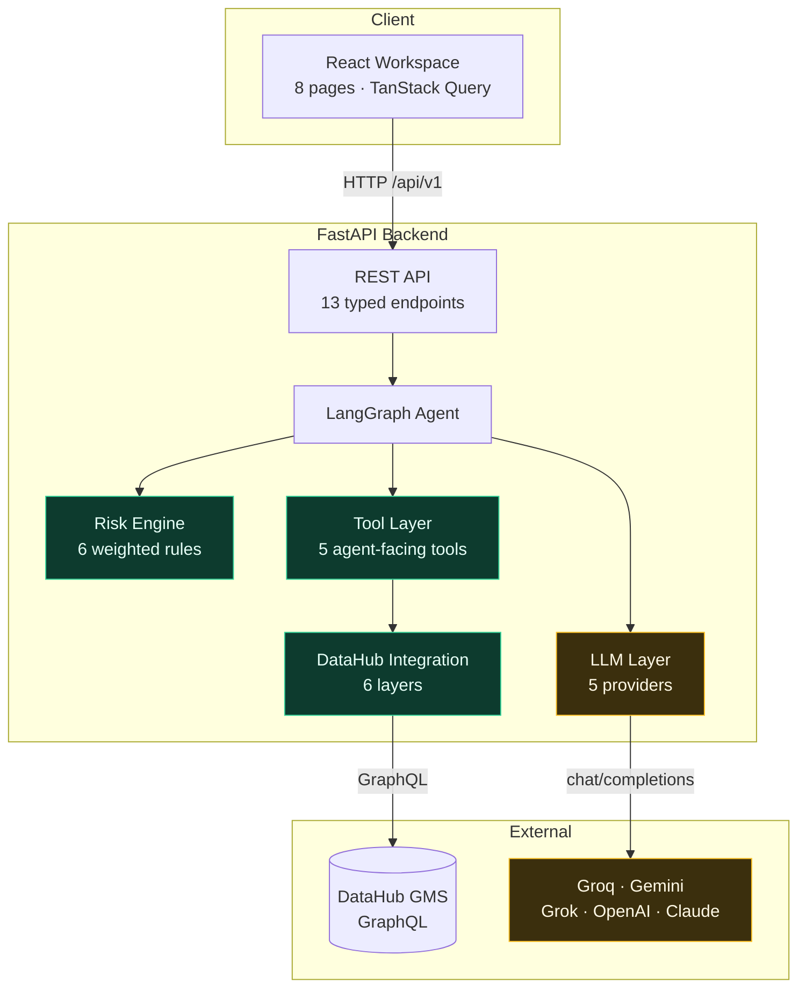
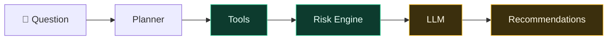
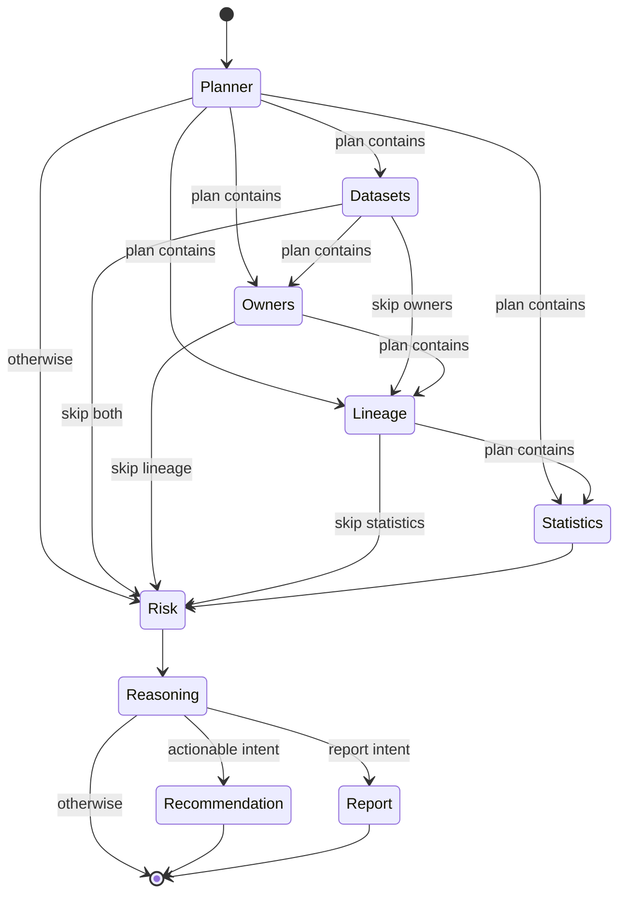
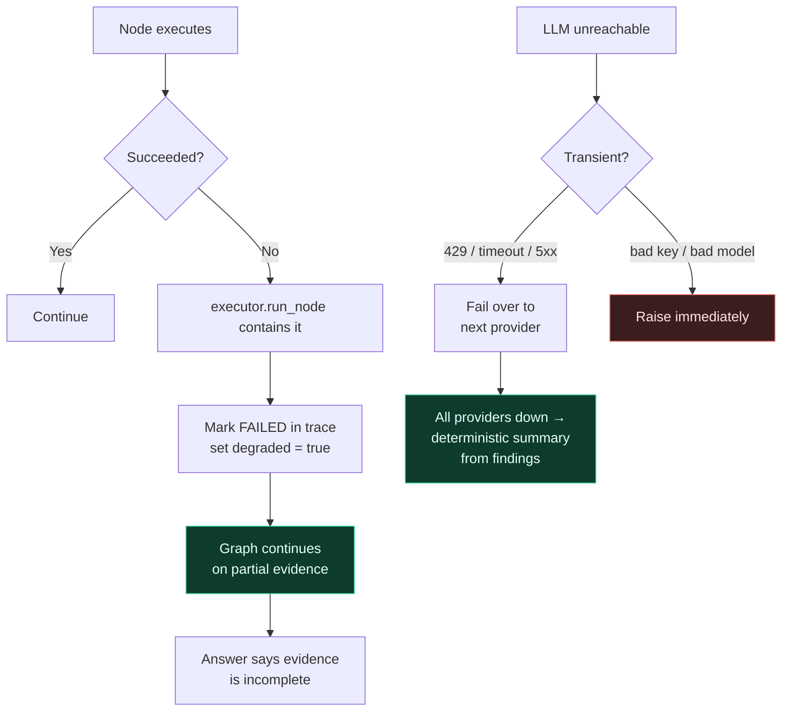
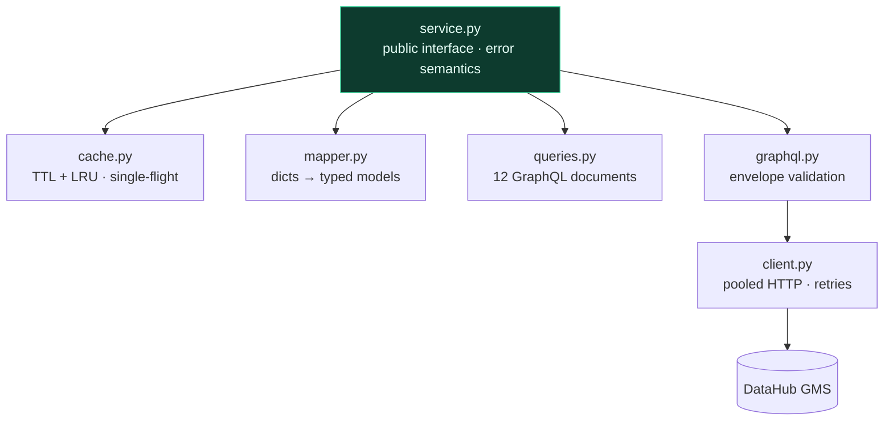
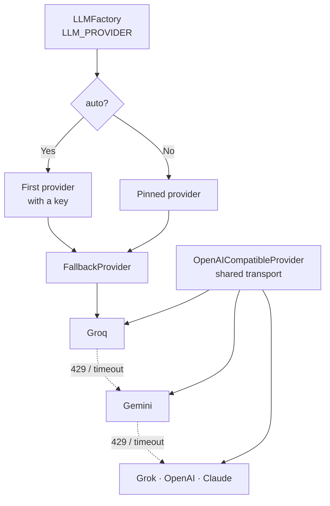
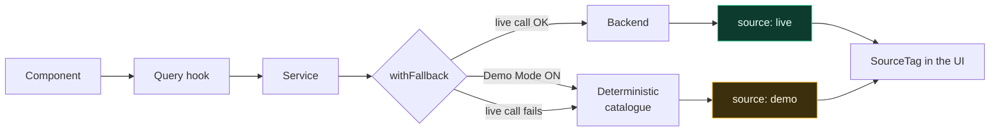

# Architecture

How DataGuardian AI turns DataHub metadata into governance decisions, and why
the numbers it produces are reproducible.

Throughout these diagrams: **green is deterministic, amber is generative.**
That colour split is the single most important thing to understand about the
system.

---

## 1. System architecture



**The boundary that matters:** the LLM layer never touches the DataHub
integration. It receives serialised JSON from the Tool layer and nothing else.
That is structural — no node in the graph holds a DataHub client — rather than
a convention someone could accidentally break.

---

## 2. AI workflow



The facts are gathered and judged before the model is ever called. By the time
the LLM runs, the verdict already exists — its job is to explain it.

---

## 3. LangGraph agent



**Every edge is conditional.** The planner writes `state["plan"]` — a list of
node names — and each router asks "what is the next pipeline node the plan
actually contains?" Routing lives in *data*, not control flow, so adding an
intent is a mapping entry rather than a pipeline rewrite.

### Tool selection by intent

| Intent | Tools run | Skipped |
| --- | --- | --- |
| `find_missing_owners` | dataset, owner | lineage, statistics |
| `analyze_lineage` | dataset, lineage | owner, statistics |
| `find_risky_datasets` | dataset, owner, lineage | statistics |
| `analyze_governance` | dataset, owner, statistics | lineage |
| `generate_report` | dataset, owner, statistics, report | lineage |
| `generate_documentation` | dataset, statistics | owner, lineage |

Skipped nodes are still recorded in the trace. "It did not call the lineage
tool" is the evidence that the agent plans — hiding it would lose the point.

---

## 4. Request lifecycle

```mermaid
sequenceDiagram
    actor User
    participant UI as React
    participant API as FastAPI
    participant AG as Agent
    participant TL as Tools
    participant DH as DataHub
    participant RE as Risk Engine
    participant LLM

    User->>UI: "Find datasets without owners"
    UI->>API: POST /api/v1/agent/analyze
    API->>AG: analyze(question)

    AG->>AG: Planner: intent + tool selection
    Note over AG: rules first; LLM only on a tie

    AG->>TL: DatasetTool.list()
    TL->>DH: GraphQL listDatasets
    DH-->>TL: metadata
    TL-->>AG: typed models

    AG->>TL: OwnerTool.list()
    TL->>DH: GraphQL aggregateOwners
    DH-->>TL: owner facets
    TL-->>AG: typed models

    Note over AG: lineage + statistics SKIPPED

    AG->>RE: assess(datasets)
    RE-->>AG: score 50, level HIGH, 5 findings

    AG->>LLM: explain(verdict + evidence)
    LLM-->>AG: summary + business impact

    AG->>LLM: recommend(findings)
    LLM-->>AG: corrective actions

    AG-->>API: AgentResult + trace
    API-->>UI: 200 JSON
    UI->>User: answer + execution timeline
```

---

## 5. Failure handling



| Failure | Behaviour |
| --- | --- |
| One tool fails | Node marked FAILED, graph continues, `degraded: true` |
| DataHub down | Findings empty, answer states the evidence is incomplete |
| LLM rate-limited | Automatic fail-over to the next configured provider |
| All LLMs down | Deterministic summary from findings; **score unaffected** |
| Whole graph fails | Still returns the contract, never raises to the API |

**Only transient failures fail over.** A rejected API key would fail
identically on the next provider, so retrying it just burns quota and hides
the real error.

A degraded run returns **HTTP 200**. A partial answer is a *result*, not a
transport failure; non-2xx is reserved for genuine request problems.

---

## 6. DataHub integration layers



Each layer depends only on those below it. Two properties are load-bearing:

**GraphQL returns HTTP 200 on failure.** `graphql.py` exists so a caller never
reads `data` as `None` and fails later with a confusing mapping error.

**The cache never stores failures.** A DataHub blip cannot be pinned in place
for the whole TTL — the next caller retries for real.

---

## 7. LLM provider layer



All five providers speak OpenAI's chat-completions protocol, so the transport
— auth, retries, error translation, response mapping — lives in one place and
each provider is a ~20-line configuration file.

Switching model or vendor is a config change:

```bash
LLM_PROVIDER=gemini
LLM_MODEL=gemini-2.5-flash
```

---

## 8. Frontend data flow



Every service returns `Sourced<T>` carrying a `source` tag, and every panel
renders it. In a product whose entire pitch is trustworthy governance data,
showing invented figures unlabelled would undermine the thing being
demonstrated.

---

## Further reading

- [`backend/app/agents/README.md`](../backend/app/agents/README.md) — agent internals
- [`backend/app/llm/README.md`](../backend/app/llm/README.md) — adding a provider
- [`backend/app/integrations/datahub/README.md`](../backend/app/integrations/datahub/README.md) — DataHub layers
- [`docs/datahub.md`](datahub.md) — DataHub setup and debugging
- [`docs/demo-script.md`](demo-script.md) — the 4-minute walkthrough
